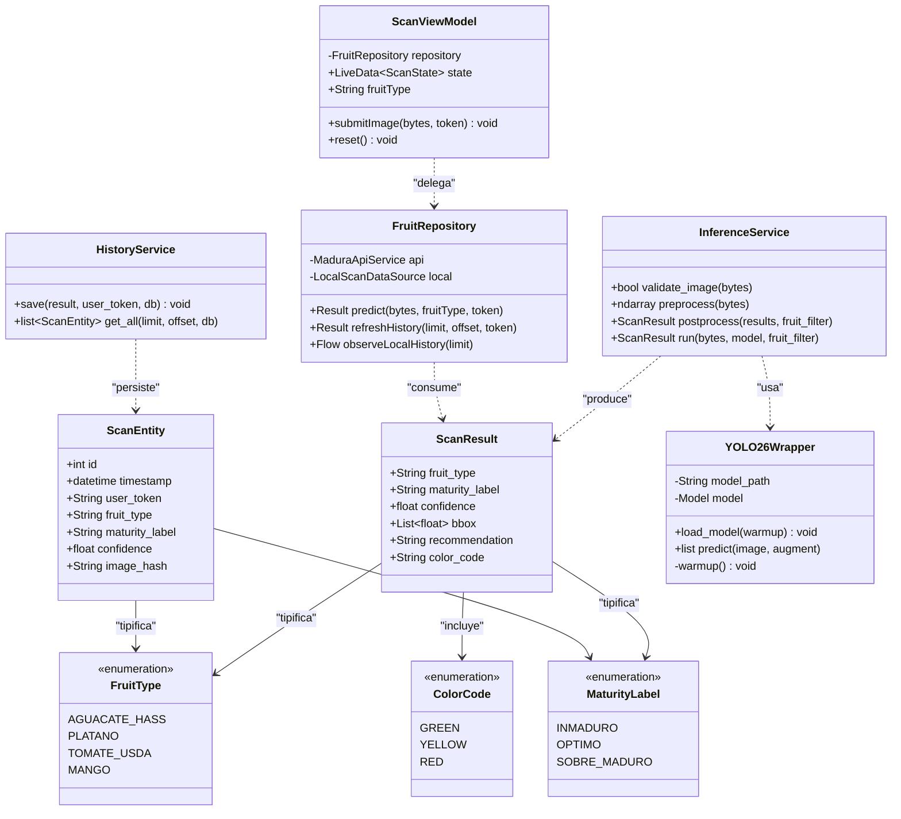
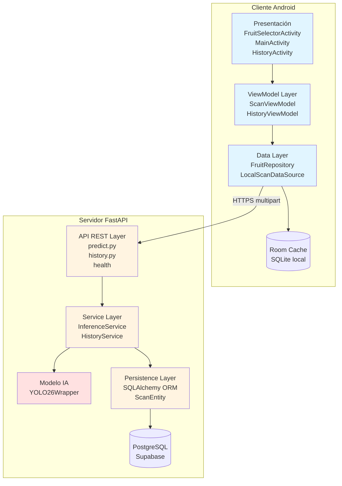

# Vista Lógica — MaduraApp
## Modelo 4+1 de Kruchten · Vista 1 de 5

> La **Vista Lógica** describe el sistema desde la perspectiva del usuario final y del analista funcional. Responde a la pregunta **¿qué hace el sistema?** mediante la identificación de los elementos del dominio, sus responsabilidades y sus relaciones. Es la vista que más directamente refleja los requisitos funcionales definidos en la ERS.

---

## 1. Propósito y audiencia

| Aspecto | Detalle |
|---------|---------|
| **Audiencia primaria** | Usuarios finales, analistas de negocio, docente evaluador |
| **Preocupación** | Funcionalidad provista por el sistema |
| **Notación principal** | UML — diagrama de clases, diagrama de componentes |
| **Documentos relacionados (ERS)** | RF-01 a RF-12 (requerimientos funcionales) |

---

## 2. Modelo del dominio

El dominio de MaduraApp se estructura en torno a tres conceptos centrales:

### 2.1 Conceptos del dominio

| Concepto | Descripción | Cardinalidad |
|----------|-------------|--------------|
| **Fruta (FruitType)** | Una de las cuatro frutas climatéricas soportadas por el modelo. Enumerable: `aguacate_hass`, `platano`, `tomate_usda`, `mango`. | 4 instancias fijas |
| **Estado de madurez (MaturityLabel)** | Categoría del ciclo de vida post-cosecha. Enumerable: `INMADURO`, `OPTIMO`, `SOBRE_MADURO`. | 3 instancias fijas |
| **Escaneo (ScanResult)** | Resultado de aplicar el modelo a una imagen específica. Incluye fruta detectada, madurez, confianza, bbox y recomendación. | N (creciente en el tiempo) |
| **Historial (ScanEntity)** | Persistencia de cada ScanResult vinculado a un token de usuario. | N |
| **Recomendación** | Texto agronómico contextualizado por la combinación (FruitType, MaturityLabel). | 12 combinaciones (4×3) |

### 2.2 Reglas de negocio relevantes

- **RN-01:** Un escaneo solo es válido si la confianza del modelo supera el umbral `CONFIDENCE_THRESHOLD` (actualmente 0.55, configurable por entorno).
- **RN-02:** Si el usuario pre-selecciona una fruta, el umbral se relaja al 50% del valor base (0.275) porque las clases competidoras quedan acotadas a 3.
- **RN-03:** Toda predicción exitosa debe persistirse en el historial.
- **RN-04:** El historial es paginable y vinculado a un token (`anonymous` si no se autentica).
- **RN-05:** Las imágenes nunca se persisten — solo el resultado del escaneo (privacidad).

---

## 3. Diagrama de clases (UML)

> Diagrama PNG existente: [`MaduraApp_DiagramaClases_v2.png`](../MaduraApp_DiagramaClases_v2.png)
> Versión actualizada incorporando los componentes del Sprint 2:

---

## 4. Diagrama de componentes lógicos

El sistema se descompone en seis componentes lógicos de alto nivel:

### 4.1 Responsabilidades por componente

| Componente | Responsabilidad | Tecnología |
|------------|----------------|------------|
| **Presentación móvil** | Captura de imagen, navegación, render de resultados | Android Activities + CameraX + ViewBinding |
| **ViewModel** | Lógica de estado de UI, llamadas al repositorio, manejo de errores | AndroidX Lifecycle + LiveData + Kotlin Coroutines |
| **Data móvil** | Orquestación API + cache local, single source of truth | Retrofit 2 + Room 2.6 |
| **API REST** | Routing, validación de inputs, manejo de respuestas HTTP | FastAPI 0.135 |
| **Servicios backend** | Lógica de negocio (inferencia, persistencia, recomendaciones) | Python 3.12 |
| **Modelo IA** | Carga del modelo, predicción, optional TTA | Ultralytics + PyTorch |
| **Persistence** | Mapeo objeto-relacional, transacciones async | SQLAlchemy 2.0 async + asyncpg |

---

## 5. Trazabilidad con requerimientos funcionales (ERS)

La vista lógica satisface los siguientes RF documentados en la ERS:

| ID RF | Requerimiento | Componente que lo implementa |
|-------|---------------|------------------------------|
| RF-01 | Capturar imagen con cámara | MainActivity + CameraX |
| RF-02 | Seleccionar imagen desde galería | MainActivity + ActivityResultContracts |
| RF-03 | Pre-seleccionar fruta a escanear | FruitSelectorActivity |
| RF-04 | Enviar imagen al backend | FruitRepository + MaduraApiService |
| RF-05 | Clasificar madurez con IA | InferenceService + YOLO26Wrapper |
| RF-06 | Devolver recomendación contextualizada | RECOMMENDATION_MAP en inference_service.py |
| RF-07 | Persistir cada escaneo | HistoryService + ScanEntity |
| RF-08 | Consultar historial paginado | history.py + HistoryService |
| RF-09 | Visualizar historial offline | LocalScanDataSource + Room |
| RF-10 | Indicar estado de madurez visual (semáforo) | UI MainActivity + ColorCode |
| RF-11 | Validar formato de imagen | predict.py (Content-Type allowlist) |
| RF-12 | Health check del servicio | router /v1/health |

---

## 6. Relación con otras vistas

- **Vista de Procesos** ([`02_Vista_Procesos.md`](02_Vista_Procesos.md)) — describe cómo se ejecutan estos componentes en runtime (corrutinas, async, hilos).
- **Vista de Desarrollo** ([`03_Vista_Desarrollo.md`](03_Vista_Desarrollo.md)) — describe cómo se organizan estas clases en paquetes/módulos del repositorio.
- **Vista Física** ([`04_Vista_Fisica.md`](04_Vista_Fisica.md)) — describe dónde se ejecuta cada componente (Android device, Render container, Supabase).
- **Vista de Escenarios** ([`05_Vista_Escenarios.md`](05_Vista_Escenarios.md)) — ilustra cómo estos componentes colaboran para los casos de uso principales.
