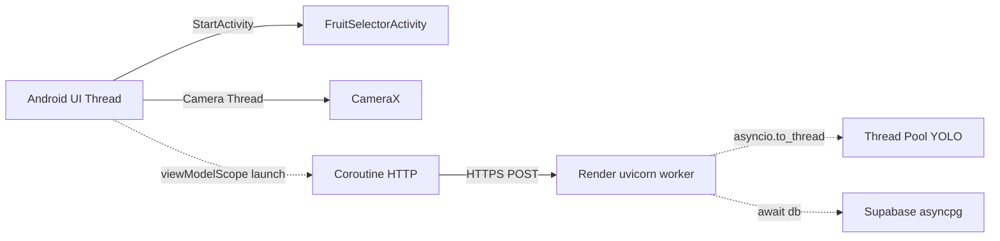
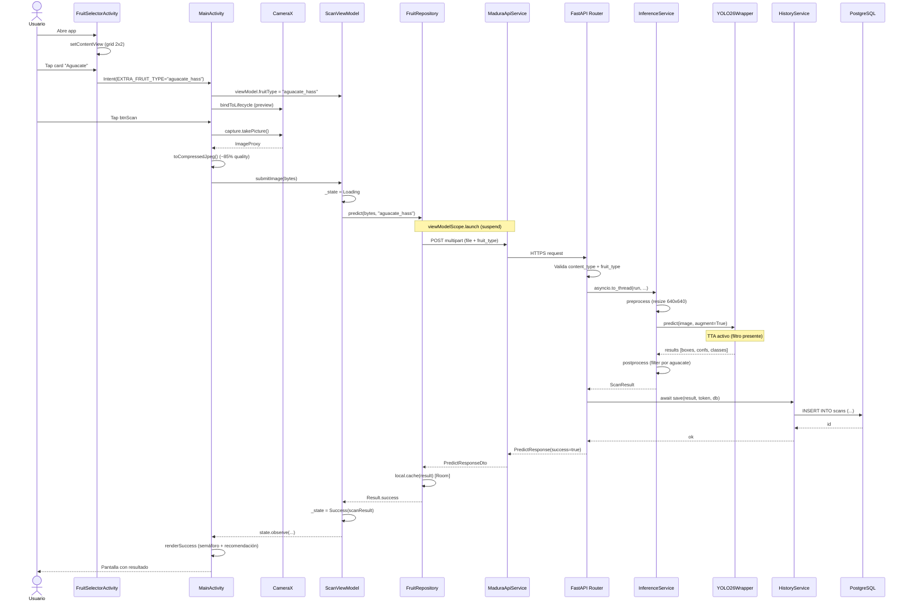
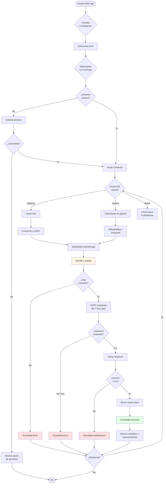
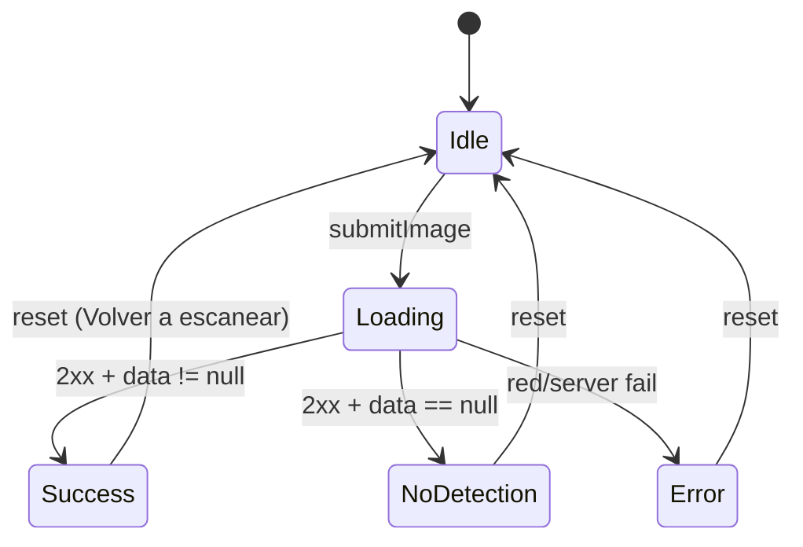

# Vista de Procesos — MaduraApp
## Modelo 4+1 de Kruchten · Vista 2 de 5

> La **Vista de Procesos** modela el comportamiento del sistema en tiempo de ejecución, abordando preocupaciones de **concurrencia**, **sincronización**, **performance** y **distribución**. Responde a la pregunta **¿cómo se comporta el sistema cuando varios usuarios o tareas se ejecutan simultáneamente?**

---

## 1. Propósito y audiencia

| Aspecto | Detalle |
|---------|---------|
| **Audiencia primaria** | Integradores de sistemas, ingenieros de rendimiento |
| **Preocupación** | Concurrencia, latencia, escalabilidad, deadlocks |
| **Notación principal** | UML — diagrama de secuencia, diagrama de actividades |

---

## 2. Modelo de concurrencia

MaduraApp opera con tres modelos de concurrencia coordinados:

### 2.1 Concurrencia en Android (cliente)

| Mecanismo | Uso | Hilo |
|-----------|-----|------|
| **Hilo principal (UI thread)** | Render, observación de LiveData, manejo de eventos | Main |
| **Coroutines de Kotlin** | Llamadas HTTP al backend, acceso a Room | `viewModelScope` (default: Dispatchers.Default) |
| **Hilo de CameraX** | Captura de frames, encoding JPEG | `Executors.newSingleThreadExecutor()` |
| **GalleryLauncher async** | Decode subsampled de imagen elegida | Implícito en ActivityResultContracts |

**Garantías:**
- El hilo de UI **nunca** ejecuta operaciones de red ni de disco.
- La cancelación se propaga automáticamente al destruir el ViewModel (`viewModelScope` se cancela).

### 2.2 Concurrencia en backend FastAPI

| Mecanismo | Uso | Tipo |
|-----------|-----|------|
| **Event loop async** | Manejo de requests HTTP, queries a BD | asyncio (un thread) |
| **`asyncio.to_thread`** | Inferencia YOLO (CPU-bound) | Pool de threads (no bloquea event loop) |
| **AsyncSession SQLAlchemy** | Transacciones de BD | asyncpg driver (asíncrono nativo) |
| **Uvicorn workers** | Manejo de conexiones HTTP | 1 worker (Render Free tier) |

**Garantía clave:** Mientras YOLO procesa una imagen (~150-300 ms), el event loop puede atender otras requests (health checks, history queries) sin bloquearse.

### 2.3 Concurrencia inter-sistemas



---

## 3. Diagrama de secuencia — CU-01 Escaneo con cámara (camino feliz)

Este diagrama traza el flujo completo desde que el usuario presiona "Escanear" hasta que ve el resultado en pantalla.



### 3.1 Latencias esperadas

| Tramo | Tiempo típico (CPU Render Free) | Tiempo en localhost |
|-------|--------------------------------|---------------------|
| Captura + compresión JPEG | 50–150 ms | 30–80 ms |
| Transferencia HTTPS (LTE) | 200–500 ms | < 5 ms |
| Validación + read del file | 5–20 ms | 2–10 ms |
| Preprocess + resize | 30–60 ms | 20–40 ms |
| Inferencia YOLO sin TTA | 200–400 ms | 80–150 ms |
| Inferencia YOLO con TTA | 400–800 ms | 160–300 ms |
| Postprocess | < 5 ms | < 5 ms |
| INSERT en BD | 50–150 ms | 5–10 ms |
| Render UI | < 50 ms | < 50 ms |
| **Total user-perceived** | **~1.5 – 2.5 s** | **~250 – 500 ms** |

---

## 4. Diagrama de actividades — flujo completo con bifurcaciones



---

## 5. Manejo de estados asíncronos

El cliente Android implementa una **máquina de estados explícita** en `ScanState`:

```kotlin
sealed class ScanState {
    object Idle : ScanState()
    object Loading : ScanState()
    data class Success(val result: ScanResultDto) : ScanState()
    data class NoDetection(val message: String) : ScanState()
    data class Error(val cause: Throwable) : ScanState()
}
```

### 5.1 Transiciones válidas



Esta máquina garantiza que la UI siempre refleja un estado bien definido, evitando renders inconsistentes (ej. spinner + resultado simultáneos).

---

## 6. Política de timeouts y reintentos

| Capa | Timeout | Política de reintento |
|------|---------|----------------------|
| OkHttp connect | 15 s | Sin reintento automático (manual via "Volver a escanear") |
| OkHttp read | 30 s | Sin reintento automático |
| OkHttp write | 30 s | Sin reintento automático |
| Supabase (asyncpg) | Default driver | Reconexión transparente del pool |
| Render cold start | ~ 30–60 s | No mitigado automáticamente — primer request post-idle puede dar timeout |

**Decisión arquitectónica:** No se implementan reintentos automáticos en el cliente para evitar **doble facturación** en historial cuando una respuesta llega tarde pero exitosa. El usuario decide reintentar explícitamente.

---

## 7. Consideraciones de escalabilidad

| Dimensión | Limitante actual | Mitigación si crece |
|-----------|------------------|---------------------|
| **Throughput backend** | 1 uvicorn worker en Render Free | Escalar a Standard ($25/mo) → 2-4 workers |
| **RAM** | 512 MB total (PyTorch ~500 MB) | Quantizar modelo INT8 o cambiar plan |
| **Conexiones BD** | Pooler Supabase (~ 60 conn) | Suficiente para uso académico |
| **Cold start** | ~ 30 s post-inactividad | Keepalive workflow GitHub Actions (cada 14 min) |
| **Almacenamiento BD** | 500 MB Supabase free | Cleanup periódico de historial > 90 días |

---

## 8. Relación con otras vistas

- **Vista Lógica** ([`01_Vista_Logica.md`](01_Vista_Logica.md)) — define los componentes; esta vista describe cómo se comunican en runtime.
- **Vista Física** ([`04_Vista_Fisica.md`](04_Vista_Fisica.md)) — describe dónde corre cada proceso (nodos físicos).
- **Vista de Escenarios** ([`05_Vista_Escenarios.md`](05_Vista_Escenarios.md)) — los diagramas de secuencia aquí son el detalle del escenario CU-01.
