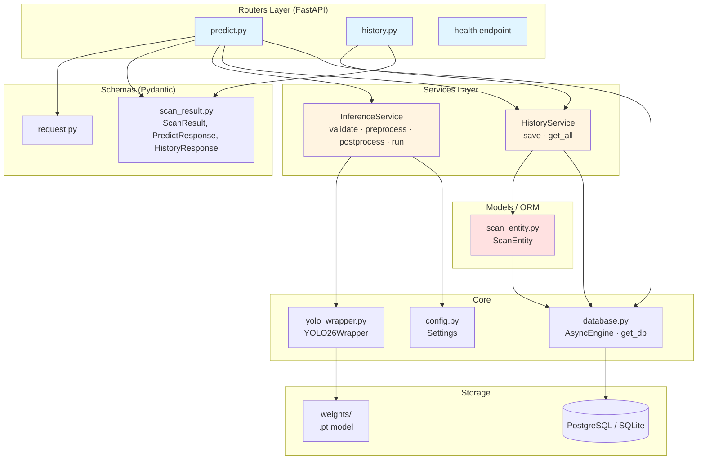
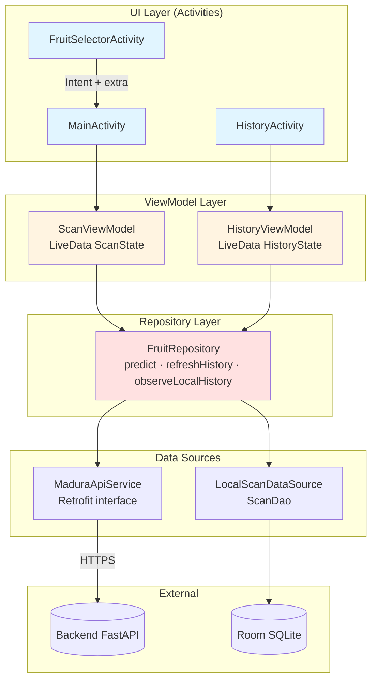
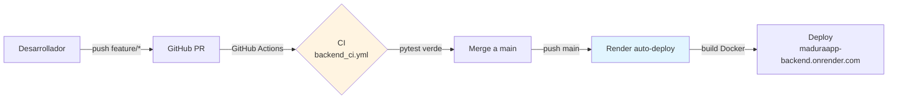

# Vista de Desarrollo — MaduraApp
## Modelo 4+1 de Kruchten · Vista 3 de 5

> La **Vista de Desarrollo** describe la **organización estática del software** desde la perspectiva del programador. Documenta cómo el código se descompone en módulos, capas, paquetes y dependencias. Responde a la pregunta **¿cómo está estructurado el código y cómo se gestiona?**

---

## 1. Propósito y audiencia

| Aspecto | Detalle |
|---------|---------|
| **Audiencia primaria** | Programadores, mantenedores, líder técnico |
| **Preocupación** | Organización del código, modularidad, gestión de dependencias, build |
| **Notación principal** | Diagramas de paquetes, diagrama de capas |

---

## 2. Estructura general del repositorio

El proyecto vive en el repositorio público `MaduraApp-Produccion` con la siguiente organización macro:

```
MaduraApp-Produccion/
├── .github/
│   └── workflows/
│       └── keepalive.yml          # Mantiene Render Free activo
├── Documentación/                  # Diagramas + informes (PDF, PNG, MD)
│   └── Evaluacion_2/              # Documentos de esta evaluación
├── Gestión/                       # Bitácora de proyecto (PM)
├── Producto/                      # El código del sistema
│   ├── backend/
│   ├── frontend/
│   ├── scripts/                   # Pipeline CRISP-DM (entrenamiento)
│   ├── notebooks/                 # Colab/Kaggle del entrenamiento
│   ├── docker-compose.yml
│   ├── CLAUDE.md                  # Contexto para asistentes IA
│   └── README.md
├── render.yaml                    # Blueprint de despliegue Render
└── README.md
```

**Justificación de la separación `Documentación/ Gestión/ Producto/`:** alineada con la estructura sugerida por DuocUC para entregables académicos, separa los entregables formales (informes, diagramas) de la gestión del proyecto (Gantt, actas) y del producto en sí (código).

---

## 3. Estructura del backend (`Producto/backend/`)

### 3.1 Layout de paquetes

```
backend/
├── app/
│   ├── __init__.py
│   ├── main.py                     # Entry point — lifespan + routers
│   ├── core/
│   │   ├── config.py               # Settings via pydantic-settings
│   │   ├── database.py             # AsyncEngine + get_db dependency
│   │   └── yolo_wrapper.py         # Wrapper YOLO26n
│   ├── routers/
│   │   ├── predict.py              # POST /v1/predict
│   │   └── history.py              # GET /v1/history
│   ├── services/
│   │   ├── inference_service.py    # Lógica inferencia + recomendaciones
│   │   └── history_service.py      # CRUD historial
│   ├── models/
│   │   └── scan_entity.py          # ORM SQLAlchemy
│   └── schemas/
│       ├── request.py              # Pydantic input
│       └── scan_result.py          # Pydantic response
├── alembic/
│   ├── env.py                      # Async migration runner
│   └── versions/
│       └── 0001_create_scans_table.py
├── alembic.ini
├── tests/
│   ├── conftest.py                 # Fixtures (in-memory SQLite)
│   ├── test_predict.py             # 5 tests
│   └── test_history.py             # 4 tests
├── weights/
│   ├── .gitkeep
│   └── yolo26n_maduraapp.pt        # Modelo entrenado (5.2 MB)
├── Dockerfile
├── pytest.ini
├── requirements.txt
└── .env.example
```

### 3.2 Diagrama de capas — Backend



### 3.3 Principios aplicados

- **Dependencia direccional estricta:** `routers → services → models`. Los services nunca importan routers; los models nunca importan services.
- **Inyección por `Depends`:** la sesión de BD se inyecta por dependencia FastAPI, facilitando el override en tests con `app.dependency_overrides`.
- **Lazy imports** de pesado (ultralytics, torch) en `yolo_wrapper.py` para minimizar tiempo de cold start si el endpoint requerido no necesita el modelo.
- **`Settings` única fuente de truth** para configuración. Nada de constantes scattered o `os.getenv` directos.

---

## 4. Estructura del frontend (`Producto/frontend/`)

### 4.1 Layout de paquetes

```
frontend/
├── app/
│   ├── build.gradle.kts              # Gradle KTS (single-module)
│   ├── proguard-rules.pro
│   └── src/
│       ├── main/
│       │   ├── AndroidManifest.xml
│       │   ├── java/cl/duoc/maduraapp/
│       │   │   ├── MaduraApp.kt           # Application class (DI manual)
│       │   │   ├── MainActivity.kt        # Cámara + galería + render
│       │   │   ├── data/
│       │   │   │   ├── api/
│       │   │   │   │   ├── ApiClient.kt           # Retrofit singleton
│       │   │   │   │   └── MaduraApiService.kt    # Interface endpoints
│       │   │   │   ├── dto/
│       │   │   │   │   ├── HistoryResponseDto.kt
│       │   │   │   │   ├── PredictResponseDto.kt
│       │   │   │   │   └── ScanResultDto.kt
│       │   │   │   ├── local/
│       │   │   │   │   ├── Converters.kt
│       │   │   │   │   ├── LocalScanDataSource.kt
│       │   │   │   │   ├── MaduraDatabase.kt      # Room DB
│       │   │   │   │   ├── ScanCacheEntity.kt
│       │   │   │   │   └── ScanDao.kt
│       │   │   │   └── repository/
│       │   │   │       └── FruitRepository.kt
│       │   │   └── ui/
│       │   │       ├── ScanState.kt
│       │   │       ├── ScanViewModel.kt
│       │   │       ├── history/
│       │   │       │   ├── HistoryActivity.kt
│       │   │       │   ├── HistoryAdapter.kt
│       │   │       │   ├── HistoryState.kt
│       │   │       │   └── HistoryViewModel.kt
│       │   │       └── selector/
│       │   │           └── FruitSelectorActivity.kt
│       │   └── res/
│       │       ├── drawable/
│       │       ├── layout/
│       │       │   ├── activity_fruit_selector.xml
│       │       │   ├── activity_history.xml
│       │       │   ├── activity_main.xml
│       │       │   └── item_scan_history.xml
│       │       ├── menu/
│       │       ├── mipmap-*/
│       │       └── values/
│       │           ├── colors.xml
│       │           ├── strings.xml
│       │           └── themes.xml
│       └── test/java/cl/duoc/maduraapp/   # Unit tests JVM
│           ├── data/repository/FruitRepositoryTest.kt
│           ├── testing/MainCoroutineRule.kt
│           └── ui/
│               ├── ScanViewModelTest.kt
│               └── history/HistoryViewModelTest.kt
├── build.gradle.kts                  # Root Gradle
├── gradle.properties
├── gradle/wrapper/
└── settings.gradle.kts
```

### 4.2 Arquitectura MVVM — Frontend



### 4.3 Principios aplicados

- **Single Activity per feature:** cada Activity tiene un único propósito (Selector → Scan → History). Sin Fragments para mantener simplicidad.
- **ViewModel sin referencias al Context de Activity** — usa `viewModelScope` y recibe el repository por constructor (testeable).
- **Single Source of Truth** en `FruitRepository.refreshHistory`: el backend es la verdad; al refrescar se limpia Room y se vuelve a llenar.
- **No Dependency Injection framework** (sin Hilt/Koin) — DI manual en `MaduraApp.kt` para evitar complejidad innecesaria en proyecto académico.
- **DTOs separados del ORM:** `ScanResultDto` (API) ≠ `ScanCacheEntity` (Room). Converter en `Converters.kt` para `bbox: List<Float>` ↔ `String`.

---

## 5. Gestión de dependencias

### 5.1 Backend (`requirements.txt`)

| Dependencia | Versión | Propósito |
|-------------|---------|-----------|
| fastapi | 0.135.x | Framework web async |
| uvicorn[standard] | 0.34.x | ASGI server |
| pydantic | 2.x | Validación de schemas |
| pydantic-settings | 2.x | Settings desde .env |
| sqlalchemy | 2.0.x | ORM async |
| asyncpg | 0.29.x | Driver PostgreSQL async |
| aiosqlite | 0.20.x | Driver SQLite async (dev) |
| alembic | 1.13.x | Migraciones de BD |
| ultralytics | 8.3+ | YOLO26n |
| pillow | 10.x | Manipulación de imágenes |
| numpy | 1.26.x | Arrays para ML |
| python-multipart | 0.0.x | Soporte multipart/form-data |
| pytest + pytest-asyncio | latest | Testing |

### 5.2 Frontend (`build.gradle.kts`)

| Dependencia | Versión aprox | Propósito |
|-------------|---------------|-----------|
| AndroidX Core KTX | 1.13 | Extensiones Kotlin a Android SDK |
| AndroidX AppCompat | 1.7 | Backport de UI components |
| Material Components | 1.12 | Material Design 3 |
| CameraX | 1.4 | Captura de imagen |
| AndroidX Lifecycle | 2.8 | ViewModel + LiveData |
| Retrofit2 | 2.11 | Cliente HTTP |
| OkHttp + logging | 4.12 | Capa de transporte HTTP |
| Kotlinx Serialization | 1.7 | JSON parsing |
| Room | 2.6 | Cache local SQLite |
| MockK | 1.13 | Tests unitarios |
| kotlinx-coroutines-test | 1.8 | Test runner async |
| Turbine | 1.1 | Test de Flows |
| AndroidX arch-core-testing | 2.2 | InstantTaskExecutor para LiveData |

---

## 6. Build, deploy y CI/CD

### 6.1 Build

| Componente | Comando | Output |
|------------|---------|--------|
| Backend (dev) | `uvicorn app.main:app --reload` | Servidor en localhost:8000 |
| Backend (prod) | `docker build -t maduraapp-backend .` | Imagen Docker |
| Android (debug) | `./gradlew assembleDebug` | APK debug |
| Android (release) | `./gradlew assembleRelease` | APK firmado (requiere keystore) |
| Tests backend | `pytest tests/ -v` | Reporte 9/9 |
| Tests Android | `./gradlew test` | Reporte JVM tests |

### 6.2 CI/CD



**Política:** sin merge a `main` sin CI verde. El deploy a Render se dispara automáticamente con cada push exitoso a `main`.

---

## 7. Estrategia de ramas Git

Se utilizan **dos repositorios** complementarios:

| Repo | Rama default | Propósito | Branches activas |
|------|--------------|-----------|------------------|
| `MaduraApp` (testing) | `develop` | Desarrollo activo, sandbox | main, develop, feature/* |
| `MaduraApp-Produccion` | `main` | Código desplegado en Render | main (+ backup tags) |

**Backup discipline:** antes de refactors mayores se crea tag `backup-pre-{descripción}` y se pushea. Ejemplo aplicado: `backup-pre-eval2-docs`.

---

## 8. Convenciones de código

### 8.1 Backend Python
- **PEP 8** + line length 100.
- **Type hints obligatorios** en funciones públicas.
- **Docstrings** en services y schemas críticos.
- **Async/await** en toda función que toque I/O.
- **Lazy imports** para dependencias pesadas (ultralytics, torch).

### 8.2 Frontend Kotlin
- Convenciones oficiales de Kotlin (KEEP).
- **KDoc** en clases públicas y funciones no triviales.
- Naming: `camelCase` para funciones/variables, `PascalCase` para clases, `UPPER_SNAKE_CASE` para constantes.
- Uso preferente de `sealed class` para estados y `data class` para DTOs/entities.

### 8.3 Commits
- **Conventional Commits:** `feat(scope): mensaje`, `fix(scope): mensaje`, `docs:`, `refactor:`, `test:`, `chore:`.
- Sin punto final en el subject. Mensaje en imperativo presente ("agregar X", no "agregado X").

---

## 9. Relación con otras vistas

- **Vista Lógica** ([`01_Vista_Logica.md`](01_Vista_Logica.md)) — esta vista organiza en módulos del repo lo que la lógica describe en términos abstractos.
- **Vista Física** ([`04_Vista_Fisica.md`](04_Vista_Fisica.md)) — esta vista describe la estructura **before deploy**; la física describe **after deploy**.
- **Vista de Procesos** ([`02_Vista_Procesos.md`](02_Vista_Procesos.md)) — esta vista describe la estructura estática; procesos describe el comportamiento dinámico.
