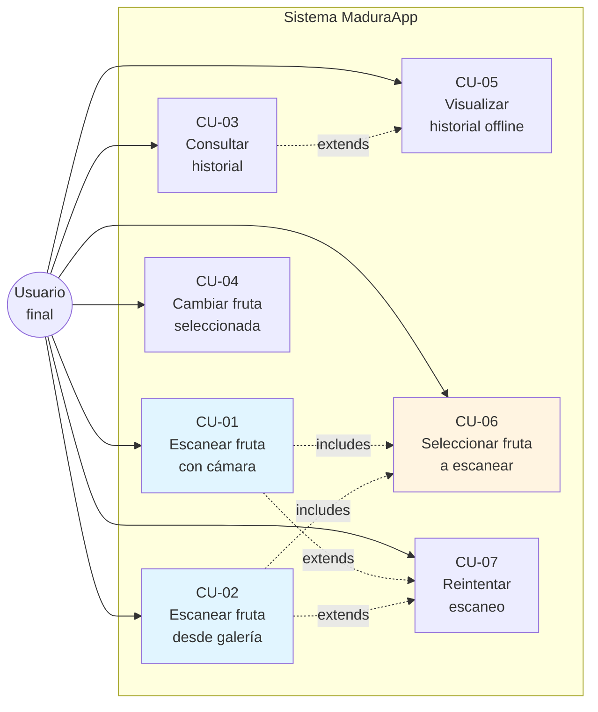

# Vista de Escenarios (+1) — MaduraApp
## Modelo 4+1 de Kruchten · Vista 5 de 5

> La **Vista de Escenarios** (también llamada "Vista +1" o "Use Case View") es la **vista integradora** del modelo 4+1. Su función es **validar** las otras cuatro vistas mostrando cómo colaboran para realizar casos de uso concretos. Si las primeras 4 vistas describen el sistema **estática y dinámicamente**, esta vista demuestra que el diseño **realmente funciona** end-to-end.

---

## 1. Propósito y audiencia

| Aspecto | Detalle |
|---------|---------|
| **Audiencia primaria** | Todos los stakeholders (técnicos y no técnicos) |
| **Preocupación** | Validación del diseño completo mediante casos de uso |
| **Notación principal** | UML — casos de uso, narrativas, sequence diagrams resumidos |

---

## 2. Actores del sistema

| Actor | Descripción | Casos de uso en los que participa |
|-------|-------------|-----------------------------------|
| **Consumidor final** | Persona que adquiere fruta y quiere saber su madurez | CU-01, CU-02, CU-03, CU-04, CU-05 |
| **Pequeño productor / feriante** | Comerciante que necesita clasificar lotes | CU-01, CU-02, CU-03 |
| **Sistema externo: Modelo YOLO** | Componente de IA que clasifica imágenes | (participante en CU-01, CU-02) |
| **Sistema externo: Base de datos** | Persistencia | (participante en CU-01, CU-03) |
| **Administrador / DevOps** | Mantiene la infraestructura | Fuera de scope del producto end-user |

---

## 3. Diagrama de casos de uso

> Diagrama existente: [`MaduraApp_DiagramaCasosDeUso.png`](../MaduraApp_DiagramaCasosDeUso.png)
> Versión actualizada para esta evaluación, incorporando los casos nuevos del Sprint 2:

---

## 4. Caso de uso troncal: CU-01 — Escanear fruta con cámara

### 4.1 Narrativa estructurada

| Campo | Descripción |
|-------|-------------|
| **ID** | CU-01 |
| **Nombre** | Escanear fruta con cámara |
| **Actor principal** | Consumidor final |
| **Stakeholders** | Productor agrícola (interés indirecto en validación del modelo) |
| **Precondiciones** | (1) App instalada en dispositivo con cámara funcional. (2) Permisos de cámara concedidos. (3) Conectividad de red disponible. (4) Backend Render activo (no en cold start). |
| **Postcondición de éxito** | (1) Usuario ve semáforo con la madurez detectada. (2) Recomendación agronómica desplegada. (3) Resultado persistido en Room (local) y en `scans` (backend). |
| **Postcondición de fallo** | (1) Estado UI = `Error` o `NoDetection`. (2) Toast con mensaje contextualizado. (3) Sin escritura en historial. |
| **Activador** | El usuario toca el botón "📷 Escanear fruta" en `MainActivity`. |
| **Frecuencia esperada** | Decenas de invocaciones por sesión de usuario. |

### 4.2 Flujo principal (camino feliz)

1. Usuario abre la app → arranca `FruitSelectorActivity`.
2. Usuario selecciona una fruta (ej. "Aguacate Hass") → se lanza `MainActivity` con `EXTRA_FRUIT_TYPE = "aguacate_hass"`.
3. CameraX inicializa el preview en el `PreviewView`.
4. Usuario apunta la cámara hacia la fruta y toca "Escanear".
5. `ImageCapture.takePicture()` retorna un `ImageProxy`.
6. La app comprime a JPEG (~85% calidad).
7. `ScanViewModel.submitImage(bytes)` cambia el estado a `Loading`.
8. `FruitRepository.predict(bytes, "aguacate_hass")` arma un `MultipartBody` con `file` + `fruit_type`.
9. POST HTTPS a `https://maduraapp-backend.onrender.com/v1/predict`.
10. Backend valida `Content-Type`, valida `fruit_type ∈ ALLOWED_FRUITS`, lee el archivo.
11. `asyncio.to_thread(inference_svc.run, ...)` libera el event loop.
12. `InferenceService.preprocess` resize a 640×640 RGB.
13. `YOLO26Wrapper.predict(image, augment=True)` ejecuta inferencia con TTA.
14. `InferenceService.postprocess(results, fruit_filter="aguacate_hass")` filtra y selecciona la mejor bbox.
15. Backend persiste `ScanEntity` en `scans` (Supabase).
16. Backend retorna `PredictResponse(success=True, data=ScanResult(...))`.
17. Frontend cachea el resultado en Room.
18. `ScanViewModel._state = Success(result)`.
19. `MainActivity.renderSuccess` pinta el círculo de madurez, fruta, recomendación y confianza.

### 4.3 Flujos alternativos

#### 4.3.1 FA-01: Sin permiso de cámara
- Paso 3a: Sistema detecta `PackageManager.PERMISSION_DENIED`.
- Sistema muestra panel de permisos con botón "Otorgar permiso".
- Usuario concede → continúa flujo principal en paso 3.
- Usuario rechaza → flujo termina.

#### 4.3.2 FA-02: Sin conexión a Internet
- Paso 9a: `OkHttp` lanza `IOException`.
- `Repository.predict` retorna `Result.failure`.
- `ScanViewModel._state = Error(ConnectException)`.
- UI muestra toast `"Error de conexión. Verifica tu internet."`.

#### 4.3.3 FA-03: Backend en cold start
- Paso 9b: Render despierta el contenedor (~30-60 s).
- Cliente excede timeout de 30 s antes de respuesta.
- `OkHttp` lanza `SocketTimeoutException`.
- Mismo manejo que FA-02; usuario reintenta y la 2da llamada típicamente succede.

#### 4.3.4 FA-04: No se detectó la fruta seleccionada
- Paso 14a: `postprocess` retorna `None` (ninguna detección supera el threshold filtrado).
- Backend retorna `PredictResponse(success=False, error="No se detectó aguacate_hass en la imagen")`.
- `ScanViewModel._state = NoDetection(message)`.
- UI muestra toast con el mensaje y habilita "Volver a escanear".

#### 4.3.5 FA-05: fruit_type inválido
- Paso 10a: `fruit_type` no está en `ALLOWED_FRUITS`.
- Backend retorna HTTP 400 con detalle del error.
- Cliente parsea como `Error`. *(Caso defensivo — no ocurre en el flujo normal porque las constantes del cliente coinciden con las del backend).*

---

## 5. Trazabilidad — ¿Cómo CU-01 ejercita las 4 vistas?

| Vista | Elementos involucrados en CU-01 |
|-------|----------------------------------|
| **Lógica** | Clases participantes: `FruitSelectorActivity`, `MainActivity`, `ScanViewModel`, `FruitRepository`, `MaduraApiService`, `InferenceService`, `YOLO26Wrapper`, `HistoryService`, `ScanEntity`, `ScanResult`, enums `FruitType`, `MaturityLabel`. |
| **Procesos** | Coroutine en `viewModelScope`, hilo de CameraX, event loop async FastAPI, `asyncio.to_thread` para YOLO, `await db.commit()` en SQLAlchemy. Estados `ScanState`: Idle → Loading → Success. |
| **Desarrollo** | Módulos `ui/`, `data/`, `core/`, `routers/`, `services/`. Dependencias: Retrofit, OkHttp, Ultralytics, asyncpg. Tests cubriendo cada capa. |
| **Física** | Dispositivo Android → HTTPS → Render container → asyncpg → Supabase PostgreSQL. Latencia total ~1.5–2.5 s. |

> ✅ Esta trazabilidad demuestra que las 4 vistas no son artefactos formales aislados, sino representaciones **complementarias** del mismo sistema.

---

## 6. Casos de uso restantes — narrativas concisas

### 6.1 CU-02 — Escanear fruta desde galería

**Diferencia con CU-01:** la fuente de la imagen es la galería del dispositivo, no la cámara.

- Usuario toca "🖼 Seleccionar de galería".
- `ActivityResultContracts.GetContent()` lanza el picker del sistema.
- `uriToJpegBytes(uri)` realiza subsampling (sample size calculado a partir del ratio outWidth/640) para evitar cargar fotos de 12 MP completas en RAM.
- Resto del flujo idéntico a CU-01 desde el paso 7.

**Valor agregado:** permite analizar fotos pre-existentes (catálogo de fotos de la feria del fin de semana, por ejemplo).

### 6.2 CU-03 — Consultar historial

- Usuario abre `HistoryActivity` desde el menú overflow.
- `HistoryViewModel.refresh()` lanza `repository.refreshHistory()`.
- Si hay red → `GET /v1/history` → backend devuelve N scans.
- `Repository.refreshHistory`:
  - Si `offset == 0` → `local.clear()` + `local.cache(item)` por cada item.
  - Caso contrario → solo agrega items (paginación).
- UI observa `observeLocalHistory(50)` como `Flow` → render reactivo.
- Si no hay red → UI muestra el contenido cacheado en Room (last-known-good).

### 6.3 CU-04 — Cambiar fruta seleccionada

- Usuario está en `MainActivity` con `fruitType = "platano"`.
- Toca el ícono ← (home) del toolbar.
- `MainActivity.finish()` → vuelve a `FruitSelectorActivity` (que se mantuvo viva como parent).
- Usuario selecciona otra fruta → nuevo `Intent` con `EXTRA_FRUIT_TYPE` diferente.

**Diseño consciente:** se usa `parentActivityName` en el manifiesto para que `setDisplayHomeAsUpEnabled(true)` haga el comportamiento Android-idiomatic correcto.

### 6.4 CU-05 — Operar offline (visualización de historial)

- Usuario abre `HistoryActivity` sin red.
- `Flow` desde Room emite el último estado cacheado.
- UI renderiza la lista normalmente.
- Botón "refresh" (pull-to-refresh) intenta `refreshHistory()` → falla silenciosamente y mantiene cache.

**Nota:** el escaneo en sí (CU-01, CU-02) **no** está disponible offline porque la inferencia ocurre en el backend. Esto es una decisión consciente para mantener el modelo en un solo lugar (versionado, actualizable) en vez de empaquetarlo en el APK (lo que aumentaría el tamaño en ~5 MB y complicaría updates).

### 6.5 CU-06 — Seleccionar fruta a escanear

- Pantalla inicial de la app.
- Grid 2×2 con cards (aguacate/plátano/tomate cherry/mango).
- Tap → `Intent(EXTRA_FRUIT_TYPE = ...)` lanza `MainActivity`.

**Justificación:** mejorar precisión del modelo al filtrar las 12 clases competidoras a las 3 de la fruta elegida. Trade-off: una pantalla más, pero la mejora de precisión (+2-3% efectivo con TTA habilitado solo para casos filtrados) lo justifica.

### 6.6 CU-07 — Reintentar escaneo

- Tras un `Error` o `NoDetection`, el botón `btnRetry` queda visible.
- Tap → `ScanViewModel.reset()` → estado vuelve a `Idle`.
- Usuario puede volver a presionar "Escanear" o "Galería".

---

## 7. Cobertura de pruebas por caso de uso

| Caso de uso | Tests automatizados que lo cubren |
|-------------|----------------------------------|
| CU-01 | `test_predict_with_fruit_filter` (backend) + `ScanViewModelTest.testSubmitImage` (Android) |
| CU-02 | `ScanViewModelTest.testSubmitImage` (cobertura compartida) |
| CU-03 | `test_history_pagination` (backend) + `HistoryViewModelTest` (Android) |
| CU-04 | No tiene test automatizado — flujo Android puro de UI |
| CU-05 | `FruitRepositoryTest.observeLocalHistory` (Android) |
| CU-06 | No tiene test automatizado — flujo Android puro de UI |
| CU-07 | Implícito en tests que cambian el estado del ViewModel |

> Los flujos puramente UI se validan mediante **defensa en vivo (demo)** en la evaluación, no con automatización (que requeriría Espresso y excede el alcance del Sprint 2).

---

## 8. Conclusión de la Vista de Escenarios

Los 7 casos de uso documentados:

- **Cubren todos los requerimientos funcionales** (RF-01 a RF-12) de la ERS.
- **Ejercitan completamente la arquitectura** descrita en las vistas Lógica, Procesos, Desarrollo y Física.
- **Tienen postcondiciones verificables** mediante inspección de la BD, logs y UI.
- **Cuentan con flujos alternativos** que documentan el manejo de errores y degradación elegante.

La integración de las 5 vistas demuestra que MaduraApp es un sistema **coherente, completo y verificable**, satisfaciendo el criterio IL2.1 de la rúbrica.

---

## 9. Relación con otras vistas

Esta vista es la **integradora** — cada escenario activa elementos descritos en las cuatro vistas previas:

- **Vista Lógica** ([`01_Vista_Logica.md`](01_Vista_Logica.md)) → las clases del dominio.
- **Vista de Procesos** ([`02_Vista_Procesos.md`](02_Vista_Procesos.md)) → secuencia de mensajes y concurrencia.
- **Vista de Desarrollo** ([`03_Vista_Desarrollo.md`](03_Vista_Desarrollo.md)) → módulos de código que se ejecutan.
- **Vista Física** ([`04_Vista_Fisica.md`](04_Vista_Fisica.md)) → nodos donde ocurre cada paso.
