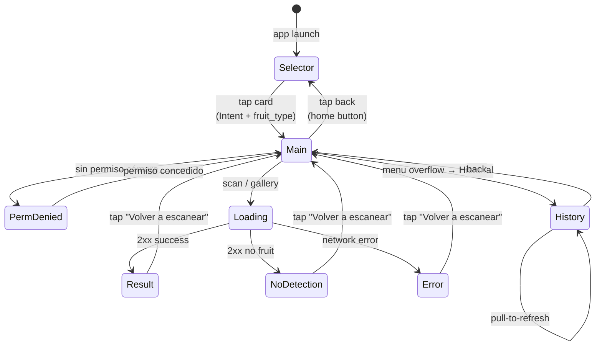

# Mockups y Diseño de Interfaz — MaduraApp

> Este documento complementa los wireframes originales de la Evaluación 1 ([`WireFrame MaduraApp.pdf`](../WireFrame%20MaduraApp.pdf)) con las pantallas nuevas o modificadas durante el Sprint 2, y describe el flujo completo de navegación de la app.

---

## 1. Sistema de diseño aplicado

| Aspecto | Decisión |
|---------|----------|
| **Material Design** | Material 3 (Material Components for Android 1.12) |
| **Tema** | `@style/Theme.MaduraApp` (modo claro, paleta basada en verdes naturales) |
| **Tipografía** | Roboto (system default) |
| **Iconografía** | Material Icons + emojis para frutas (compatibilidad multi-API sin assets vectoriales) |
| **Orientación** | `portrait` fija — la app no soporta landscape (simplifica layouts de cámara) |
| **Colores semánticos** | Verde (INMADURO/seguro), Amarillo (OPTIMO/consumir), Rojo (SOBRE_MADURO/procesar) |

### 1.1 Paleta principal (resources/values/colors.xml)

| Token | Hex aproximado | Uso |
|-------|---------------|-----|
| `md_theme_primary` | Verde oscuro #2E7D32 | Toolbar, botones primarios |
| `md_theme_background` | Beige claro #F5F0E8 | Fondo de pantallas |
| `md_theme_surface` | Blanco #FFFFFF | Cards |
| `md_theme_on_surface` | Negro #1C1B1F | Texto principal |
| `ripeness_green` | #4CAF50 | Semáforo INMADURO |
| `ripeness_yellow` | #FBC02D | Semáforo OPTIMO |
| `ripeness_red` | #E53935 | Semáforo SOBRE_MADURO |

---

## 2. Inventario de pantallas

| # | Pantalla | Estado | Layout XML | Activity |
|---|----------|--------|------------|----------|
| 1 | Selector de fruta inicial | **Nueva** (Sprint 2) | `activity_fruit_selector.xml` | `FruitSelectorActivity` |
| 2 | Pantalla principal — cámara + resultado | **Actualizada** | `activity_main.xml` | `MainActivity` |
| 3 | Pantalla de permisos | Existente | (parte de `activity_main.xml`) | (MainActivity) |
| 4 | Pantalla de loading | Existente | (parte de `activity_main.xml`) | (MainActivity) |
| 5 | Pantalla de resultado | **Actualizada** | (parte de `activity_main.xml`) | (MainActivity) |
| 6 | Historial | Existente | `activity_history.xml` + `item_scan_history.xml` | `HistoryActivity` |

---

## 3. Pantalla 1 — Selector de fruta inicial (nueva)

### 3.1 Boceto ASCII

```
┌─────────────────────────────────┐
│ ▌  MaduraApp                    │  ← Toolbar verde
├─────────────────────────────────┤
│                                 │
│   ¿Qué fruta vas a escanear?   │  ← Título 22sp
│                                 │
│   Elige el tipo de fruta para   │
│        mejorar la precisión     │  ← Subtítulo 14sp 70% alpha
│                                 │
│   ┌─────────┐   ┌─────────┐    │
│   │   🥑    │   │   🍌    │    │  ← Cards
│   │ Aguacate│   │ Plátano │    │     elevation 3dp
│   │  Hass   │   │         │    │     corner 16dp
│   └─────────┘   └─────────┘    │
│                                 │
│   ┌─────────┐   ┌─────────┐    │
│   │   🍅    │   │   🥭    │    │
│   │ Tomate  │   │  Mango  │    │
│   │ Cherry  │   │         │    │
│   │ (cherry │   │         │    │
│   │ o pera) │   │         │    │  ← Hint pequeño 10sp
│   └─────────┘   └─────────┘    │
│                                 │
└─────────────────────────────────┘
```

### 3.2 Justificación de diseño

- **Grid 2×2** maximiza el área tappable de cada card (~ 160dp × ~ 180dp) — supera los 48dp mínimo de Material Design.
- **Emojis grandes** (44-48sp) sustituyen imágenes vectoriales, reduciendo el tamaño del APK y siendo culturalmente universales.
- **Card "Tomate Cherry" con hint adicional** porque el modelo fue entrenado con Laboro Tomato dataset (cherry/pera). Sin esta aclaración el usuario podría intentar escanear tomate grande y obtener baja confianza.
- **Padding reducido en card Tomate** (12dp vs 16dp del resto) para acomodar el subtítulo sin desbordar.

### 3.3 Interacción

| Elemento | Acción | Comportamiento |
|----------|--------|----------------|
| `cardAguacate` | Tap | `startActivity(MainActivity, EXTRA_FRUIT_TYPE="aguacate_hass")` |
| `cardPlatano` | Tap | `startActivity(MainActivity, EXTRA_FRUIT_TYPE="platano")` |
| `cardTomate` | Tap | `startActivity(MainActivity, EXTRA_FRUIT_TYPE="tomate_usda")` |
| `cardMango` | Tap | `startActivity(MainActivity, EXTRA_FRUIT_TYPE="mango")` |

---

## 4. Pantalla 2 — MainActivity (actualizada)

### 4.1 Boceto ASCII — modo cámara con fruta seleccionada

```
┌─────────────────────────────────┐
│ ← Escaneando Aguacate Hass   ⋮ │  ← Toolbar con back + overflow
├─────────────────────────────────┤
│                                 │
│  ╔═══════════════════════════╗ │
│  ║                           ║ │
│  ║                           ║ │
│  ║     PREVIEW DE CÁMARA     ║ │  ← CameraX PreviewView
│  ║         (CameraX)         ║ │
│  ║                           ║ │
│  ║                           ║ │
│  ╚═══════════════════════════╝ │
│                                 │
│ ┌─────────────────────────────┐ │
│ │  📷 Escanear fruta          │ │  ← Botón primario
│ └─────────────────────────────┘ │
│ ┌─────────────────────────────┐ │
│ │  🖼 Seleccionar de galería   │ │  ← Botón secundario (NUEVO)
│ └─────────────────────────────┘ │
└─────────────────────────────────┘
```

### 4.2 Diferencias vs Evaluación 1

| Aspecto | Eval 1 | Eval 2 (actual) |
|---------|--------|-----------------|
| **Título de toolbar** | "Análisis de madurez" estático | Dinámico: "Escaneando {fruta}" si hay fruit_type |
| **Botón galería** | No existía | Nuevo — `🖼 Seleccionar de galería` |
| **Botón back** | No existía | Vuelve a `FruitSelectorActivity` |
| **Menu overflow** | Solo "Historial" | Idem (sin cambio) |

### 4.3 Boceto ASCII — modo resultado

```
┌─────────────────────────────────┐
│ ← Escaneando Aguacate Hass   ⋮ │
├─────────────────────────────────┤
│                                 │
│  ╔═══════════════════════════╗ │
│  ║   (preview se mantiene)   ║ │
│  ╚═══════════════════════════╝ │
│                                 │
│         ╭─────╮                 │
│         │     │                 │
│         │ ●●● │   ← Círculo     │
│         │     │     verde/amar  │
│         ╰─────╯     /rojo       │
│                                 │
│   Aguacate Hass · Óptimo        │  ← fmt_fruit_label
│                                 │
│   Listo para consumir.          │
│   Refrigera hasta 2 días para   │  ← Recomendación
│   retrasar maduración.          │     agronómica
│                                 │
│   Confianza: 89.4%              │
│                                 │
│ ┌─────────────────────────────┐ │
│ │  Volver a escanear          │ │  ← Reset
│ └─────────────────────────────┘ │
└─────────────────────────────────┘
```

### 4.4 Diferencias en recomendaciones (vs Eval 1)

**Antes:**
> "Consumir hoy o refrigerar hasta 2 días"

**Ahora:**
> "Listo para consumir. Refrigera hasta 2 días para retrasar maduración."

Las recomendaciones se reescribieron con **contexto agronómico** (uso del etileno, vida útil post-cosecha por fruta, técnicas de aceleración) basadas en buenas prácticas hortofrutícolas. Aporta valor real al usuario más allá del clasificador.

---

## 5. Pantalla 3 — Pantalla de permisos (sin cambios)

Se muestra cuando el usuario rechaza el permiso de cámara. Botón "Otorgar permiso" relanza el `RequestPermission` launcher.

---

## 6. Pantalla 4 — Loading (sin cambios)

`ProgressBar` indeterminado en el centro mientras `ScanState.Loading`. Botones ocultos durante el loading para prevenir múltiples envíos.

---

## 7. Pantalla 5 — Historial (sin cambios visuales mayores)

`RecyclerView` con `HistoryAdapter` (DiffUtil para updates eficientes). Cada `item_scan_history.xml`:

```
┌──────────────────────────────────────┐
│ ●  Aguacate Hass · Óptimo            │
│    25 may 2026 19:42 · 89%           │
└──────────────────────────────────────┘
```

- Círculo de color a la izquierda (verde/amarillo/rojo).
- Fruta + madurez.
- Timestamp formateado + porcentaje de confianza.

Pull-to-refresh dispara `HistoryViewModel.refresh()`.

---

## 8. Flujo de navegación entre pantallas



---

## 9. Accesibilidad

- Todos los `View` con interacción tienen `android:contentDescription` (o usan strings localizadas).
- Tamaños de texto declarados en `sp` (respetan la configuración del usuario).
- Contraste de color cumple WCAG AA en todos los labels (verificado manualmente; sin pruebas automatizadas en este sprint).
- Foco navegable por hardware keyboard / accessibility tools (Material Components lo gestiona out-of-the-box).

---

## 10. Localización

Por ahora la app está **monolingüe en español** (`values/strings.xml`). El diseño contempla un futuro `values-en/strings.xml` para inglés, pero queda fuera del alcance del Sprint 2.

Todos los textos visibles al usuario están en `strings.xml`. **No hay strings hardcodeadas en código Kotlin ni en layouts XML** (excepto emojis y formatos numéricos).

---

## 11. Referencias

- Material Design 3: https://m3.material.io
- Wireframes originales: [`Documentación/WireFrame MaduraApp.pdf`](../WireFrame%20MaduraApp.pdf)
- Implementación actual:
  - [Producto/frontend/app/src/main/res/layout/](../../Producto/frontend/app/src/main/res/layout/)
  - [Producto/frontend/app/src/main/java/cl/duoc/maduraapp/](../../Producto/frontend/app/src/main/java/cl/duoc/maduraapp/)
