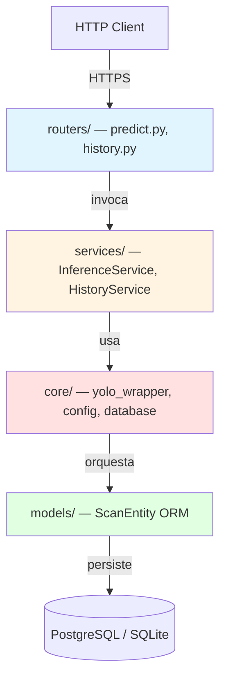
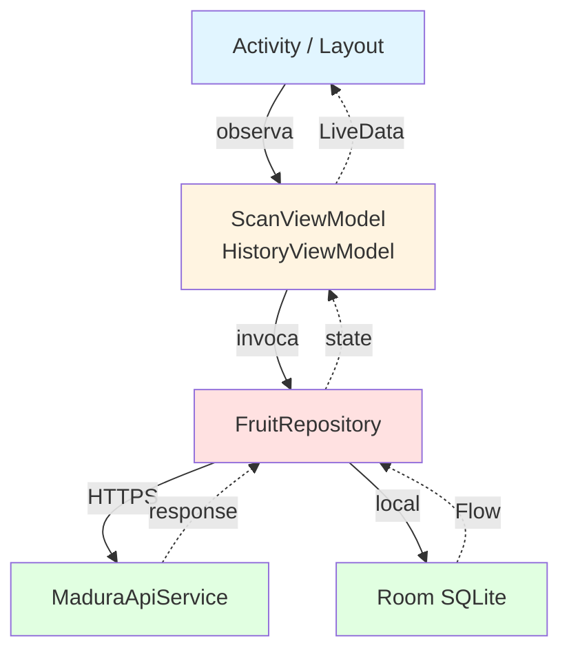

# Estado del Desarrollo de Software — MaduraApp

> Documento que detalla el **estado actual del desarrollo** del software MaduraApp al cierre de la Evaluación 2, los **avances** desde la Evaluación 1, los **patrones arquitectónicos** aplicados y la **calidad del código**.
>
> Responde al **indicador IL2.3** y al criterio 4 de la rúbrica del encargo.

---

## 1. Estado consolidado

| Componente | Estado | Cobertura |
|------------|--------|-----------|
| Backend FastAPI | ✅ Funcional, desplegado en Render | 9/9 tests passing |
| Frontend Android | ✅ Funcional, APK compilable | Tests JVM passing |
| Modelo YOLO26n | ✅ Entrenado, mAP@50 = 0.9229 | Supera KPI (≥ 0.75) |
| Pipeline CRISP-DM | ✅ Scripts listos para re-entrenar | — |
| Base de datos | ✅ Esquema migrado en producción (Supabase) | Tabla `scans` operativa |
| Documentación | ✅ ERS + 4+1 Views + configs + plan tests | Esta carpeta `Evaluacion_2/` |
| CI/CD | ✅ GitHub Actions verde en main | — |

---

## 2. Avances desde la Evaluación 1

La Evaluación 1 dejó completos los Sprints 1 (backend) y 2 (Android base) más el modelo entrenado. Los avances **desde entonces** son:

### 2.1 Selector de fruta inicial (nueva funcionalidad)

**Motivación:** la precisión del modelo depende fuertemente del número de clases competidoras. Al permitir que el usuario indique qué fruta va a escanear, las clases competidoras pasan de 12 a 3 (las tres etapas de madurez de esa fruta), reduciendo falsos positivos.

**Componentes agregados:**
- `FruitSelectorActivity.kt` — Activity de pantalla inicial.
- `activity_fruit_selector.xml` — layout grid 2×2.
- Strings: `title_selector`, `subtitle_selector`, `btn_change_fruit`, `tomate_hint`.
- AndroidManifest: `FruitSelectorActivity` registrada como `LAUNCHER`.

**Componentes modificados:**
- `MainActivity.kt` — recibe `EXTRA_FRUIT_TYPE` del Intent; título dinámico.
- `ScanViewModel.kt` — propiedad `fruitType: String?` pasada al repositorio.
- `FruitRepository.kt` — método `predict(imageBytes, fruitType, bearerToken)`.
- `MaduraApiService.kt` — endpoint `predict` con parte `fruit_type` opcional.
- `predict.py` (backend) — campo Form `fruit_type` opcional + validación.
- `inference_service.py` — parámetro `fruit_filter` en `postprocess` y `run`.

### 2.2 Selección de imagen desde galería

**Motivación:** poder analizar fotos pre-existentes (catálogo del feriante, fotos en grupo de WhatsApp, etc.) sin necesidad de re-fotografiar.

**Componentes agregados:**
- En `MainActivity.kt`:
  - `galleryLauncher` usando `ActivityResultContracts.GetContent()`.
  - Función `uriToJpegBytes(uri, quality)` con subsampling de dos pasadas (BitmapFactory inJustDecodeBounds → calcular inSampleSize → decodificar reducido).
- String: `btn_gallery` = "🖼 Seleccionar de galería".

### 2.3 Test Time Augmentation (TTA)

**Motivación:** mejorar precisión en el caso donde el usuario seleccionó fruta (vale la pena duplicar latencia para mejorar 2-3% la precisión cuando ya acotamos las clases).

**Componentes modificados:**
- `yolo_wrapper.py`:
  ```python
  def predict(self, image, augment: bool = False) -> list:
      return self.model.predict(image, imgsz=640, verbose=False, augment=augment)
  ```
- `inference_service.py` — `run()` pasa `augment=fruit_filter is not None` al wrapper.

**Resultado:** TTA solo activo cuando hay fruit_filter, evitando el costo en modo libre.

### 2.4 Umbral de confianza optimizado

**Motivación:** análisis sobre el set de validación mostró que 0.45 generaba demasiados falsos positivos en clases vecinas (`OPTIMO` vs `SOBRE_MADURO`), mientras que 0.55 mejora la precisión sin perder recall significativo.

**Cambios:**
- `config.py`: `CONFIDENCE_THRESHOLD: float = 0.55`.
- `render.yaml`: `CONFIDENCE_THRESHOLD: "0.55"`.
- Cuando hay `fruit_filter`, el umbral se relaja al 50% (0.275) porque las clases competidoras quedan acotadas.

### 2.5 Recomendaciones agronómicas detalladas

**Motivación:** las recomendaciones originales eran genéricas (ej. "consumir hoy"); las nuevas incluyen **contexto biológico** (ej. uso de etileno de plátano para acelerar maduración de aguacate) y técnicas específicas por fruta.

**Antes (ejemplo aguacate):**
> "Consumir hoy o refrigerar hasta 2 días"

**Ahora:**
> "Listo para consumir. Refrigera hasta 2 días para retrasar maduración."

Y para `INMADURO`:
> "Madurar 4-7 días a temperatura ambiente. Acelera colocándolo en bolsa de papel junto a un plátano."

**Componente modificado:** `RECOMMENDATION_MAP` en `inference_service.py` (12 entradas).

### 2.6 Optimización de RAM en producción

**Motivación:** el plan free de Render limita a 512 MB. El warmup del modelo consume ~200 MB temporales que pueden generar OOM.

**Cambios:**
- `yolo_wrapper.py`:
  ```python
  def load_model(self, warmup: bool = True) -> None:
      import os
      ...
      if warmup and os.environ.get("ENVIRONMENT") != "production":
          self.warmup()
  ```
- `inference_service.py`:
  - `ImageFile.LOAD_TRUNCATED_IMAGES = True` para evitar crashes con JPEGs ligeramente truncados.
  - `del results, image_array` + `gc.collect()` después de cada inferencia.
- `Dockerfile`: imagen `python:3.12-slim` (no `python:3.12-full`).

---

## 3. Patrones arquitectónicos aplicados

### 3.1 Backend — Layered / Clean Architecture



**Principios:**
- **Dependencia direccional estricta:** `Routers → Services → Models`. Inversiones prohibidas.
- **`Services` agnósticos al framework HTTP:** podrían reusarse desde CLI/CRON sin cambiar.
- **`Core` como infrastructure layer:** YOLO, BD, config — adapters técnicos.
- **`Schemas` (Pydantic)** separados de `Models` (SQLAlchemy ORM) — DTO ≠ Entity.

### 3.2 Frontend — MVVM con Single Source of Truth



**Principios:**
- **ViewModel sin Context:** testeable en JVM sin emulador.
- **Repository como Single Source of Truth:** combina API remota + cache local; la UI no decide de dónde viene el dato.
- **State explícito:** `sealed class ScanState { Idle, Loading, Success, NoDetection, Error }` — la UI nunca queda en estado indefinido.
- **DI manual:** sin Hilt/Koin; instancias singleton en `MaduraApp.kt` para mantener el proyecto académico simple.

### 3.3 Patrones específicos aplicados

| Patrón | Dónde se aplica | Beneficio |
|--------|----------------|-----------|
| **Repository** | `FruitRepository` | Abstrae fuente de datos para la UI |
| **Observer (LiveData)** | `ScanState`, `HistoryState` | UI reactiva sin polling |
| **Strategy implícito** | `fruit_filter` opcional en `postprocess` | Una sola lógica con/sin filtro |
| **Lazy initialization** | `ApiClient.retrofit by lazy` | Evita instanciar antes de necesitar |
| **Lazy imports** | `from ultralytics import YOLO` dentro de `load_model` | Cold start más rápido |
| **Sealed class** | `ScanState` | Type-safe estado exhaustivo |
| **Single source of truth** | Backend → Room → UI | Consistencia entre escaneo y historial |

---

## 4. Calidad del código

### 4.1 Backend Python

| Aspecto | Estado |
|---------|--------|
| **PEP 8** | Cumplido (line length 100) |
| **Type hints** | Obligatorios en funciones públicas; `from __future__ import annotations` cuando aplica |
| **Docstrings** | En `services/` y `schemas/` críticos |
| **Async/await** | En **todas** las operaciones I/O (BD, HTTP); inferencia CPU-bound via `asyncio.to_thread` |
| **Linting** | `pyflakes` implícito en pytest; sin `ruff/black` (proyecto académico) |
| **Imports** | Sin imports redundantes ni circulares |
| **Manejo de errores** | HTTPException con mensaje contextualizado; sin `except: pass` ciegos |

### 4.2 Frontend Kotlin

| Aspecto | Estado |
|---------|--------|
| **Convenciones Kotlin** | KEEP-style |
| **KDoc** | En todas las clases públicas y métodos no triviales |
| **Naming** | camelCase / PascalCase / UPPER_SNAKE_CASE consistente |
| **Inmutabilidad** | `val` por default; `var` solo cuando se requiere mutación |
| **Null safety** | `String?` y `?.let { ... }` en lugar de `!!` |
| **Coroutines** | `viewModelScope` (no `GlobalScope`); cancelación correcta |
| **Memory leaks** | Sin Context en ViewModels; ImageProxy siempre cerrado en `finally` |

### 4.3 Convenciones de Git

| Aspecto | Política |
|---------|----------|
| **Conventional Commits** | `feat:`, `fix:`, `docs:`, `refactor:`, `test:`, `chore:` |
| **Mensajes en imperativo presente** | "agregar X", no "agregado X" |
| **Trabajo en feature branches** | `feature/nombre` o `fix/nombre` desde `develop` (repo testing) |
| **PRs a `develop`/`main`** | Con CI verde como gate (no se mergea con CI rojo) |
| **Backups antes de refactors mayores** | Tag `backup-pre-{descripción}` empujado a remoto |
| **Sin force-push a main** | Bloqueado por convención de equipo |

Ejemplo de commit reciente (sincronización Sprint 2 → producción):

```
feat: sincronizar selector de fruta, galería y mejoras de inferencia

Backend:
- CONFIDENCE_THRESHOLD 0.45 → 0.55 (config.py + render.yaml)
- yolo_wrapper: agregar parámetro augment para TTA
- inference_service: fruit_filter, TTA, LOAD_TRUNCATED_IMAGES, recomendaciones detalladas
- predict router: aceptar fruit_type como campo form opcional

Frontend:
- FruitSelectorActivity (nueva pantalla inicial con grid 2x2 de frutas)
- AndroidManifest: FruitSelectorActivity como LAUNCHER
- MainActivity: integración con selector + selector de galería
- ScanViewModel: propiedad fruitType pasada al backend
- FruitRepository + MaduraApiService: soporte fruit_type en POST /v1/predict
- strings.xml: strings de selector, galería, tomate hint, Tomate Cherry
```

---

## 5. Seguridad del software

### 5.1 Validaciones de entrada implementadas

| Capa | Validación |
|------|-----------|
| `predict.py` | `Content-Type ∈ {image/jpeg, image/png, image/webp}` |
| `predict.py` | `fruit_type ∈ ALLOWED_FRUITS` si está presente |
| `inference_service.validate_image` | `len(bytes) <= 10 MB` y `PIL.Image.verify()` exitoso |
| Pydantic schemas | Coerción + validación automática de tipos en request/response |
| SQLAlchemy ORM | Queries parametrizadas — sin SQL crudo en ningún punto |
| Frontend Android | `image/*` mime type filter en gallery picker |

### 5.2 Gestión de secretos

| Secreto | Almacenamiento |
|---------|---------------|
| `DB_URL` | Variable de entorno en Render (sync:false en blueprint) |
| `AUTH_SECRET_KEY` | Auto-generada por Render (`generateValue: true`) |
| Modelo `.pt` | Versionado en Git (no es secreto — entrenado con datasets públicos) |
| Backups de BD | Cifrados con GPG simétrico antes de salir del host |
| Tokens de usuario | Bearer en header `Authorization`, validación local (futuro: JWT firmado) |

### 5.3 Superficie de ataque

| Vector | Mitigación |
|--------|-----------|
| **Inyección SQL** | ORM-only access, sin string formatting de queries |
| **Path traversal** | `YOLO_MODEL_PATH` configurable pero **dentro del container**, sin path absolute escape |
| **DoS por imágenes gigantes** | Límite 10 MB + Content-Type allowlist |
| **MITM** | HTTPS obligatorio en producción (TLS 1.2+ por Render) |
| **CORS abuse** | Allowlist explícita en `main.py` (no `*`) |
| **Cleartext traffic Android** | `usesCleartextTraffic=true` solo en debug; en release queda restringido a HTTPS |

---

## 6. Verificación contra los requerimientos funcionales

| RF de la ERS | Estado | Evidencia |
|--------------|--------|-----------|
| RF-01 — Captura imagen cámara | ✅ Implementado | `MainActivity.takePictureAndSubmit` |
| RF-02 — Imagen desde galería | ✅ Implementado | `MainActivity.galleryLauncher` |
| RF-03 — Pre-selección de fruta | ✅ Implementado | `FruitSelectorActivity` |
| RF-04 — Envío al backend | ✅ Implementado | `FruitRepository.predict` |
| RF-05 — Clasificación con IA | ✅ Implementado | `InferenceService + YOLO26Wrapper` |
| RF-06 — Recomendación contextualizada | ✅ Implementado | `RECOMMENDATION_MAP` (12 combos) |
| RF-07 — Persistencia de escaneo | ✅ Implementado | `HistoryService.save` |
| RF-08 — Consulta de historial paginado | ✅ Implementado | `GET /v1/history` |
| RF-09 — Historial offline | ✅ Implementado | Room + `LocalScanDataSource` |
| RF-10 — Semáforo visual | ✅ Implementado | `renderSuccess` + `ColorCode` |
| RF-11 — Validación de imagen | ✅ Implementado | `predict.py` + `validate_image` |
| RF-12 — Health check | ✅ Implementado | `GET /v1/health` |

**Cobertura: 12/12 (100%) de requerimientos funcionales aprobados implementados.**

---

## 7. Métricas del modelo IA

Detalle de los resultados del entrenamiento:

| Métrica | Valor |
|---------|-------|
| Arquitectura | YOLO26n (Ultralytics, Enero 2026) |
| Épocas de entrenamiento | 80 |
| Dataset | 31.940 imágenes (4 frutas × 3 etapas × ~ 2.660 imgs promedio) |
| Split | 70% train / 15% valid / 15% test |
| Tamaño del modelo | 5.2 MB |
| Hardware de entrenamiento | Kaggle Tesla T4 ×2 |
| **mAP@50** | **0.9229** |
| mAP@50-95 | ~0.71 |
| Precision (avg) | 0.94 |
| Recall (avg) | 0.87 |
| F1 score (avg) | 0.90 |
| Inferencia CPU local | ~ 80-150 ms |
| Inferencia CPU Render Free | ~ 200-400 ms |

**KPI cumplido:** mAP@50 = 0.9229 supera el umbral acordado (≥ 0.75) por **17.3 puntos**.

---

## 8. Deuda técnica reconocida

| Item | Severidad | Plan |
|------|-----------|------|
| Sin autenticación real (token "anonymous" si no se envía) | Media | Implementar JWT firmado en Evaluación 3 |
| Sin tests E2E automatizados de la app Android | Baja | Espresso post-asignatura |
| Render Free duerme post 15 min | Baja | Mitigado con keepalive, no requiere acción adicional para uso académico |
| Cliente Android sin retry automático | Baja | Decisión consciente — evita doble facturación de historial |
| Sin métricas/observability (Sentry, Datadog, etc.) | Baja | Out of scope para proyecto académico |
| Modelo entrenado con dataset desbalanceado en algunas clases | Baja | Aceptable mientras mAP@50 supere KPI |

---

## 9. Posibilidades de extensión (futuro)

| Extensión | Esfuerzo | Valor |
|-----------|----------|-------|
| Agregar más frutas (kiwi, palta Edranol, papaya) | Medio (re-entrenar modelo) | Alto |
| Versión web (React + WebAssembly del modelo) | Alto | Medio |
| Modo offline-first (modelo en dispositivo) | Alto (TFLite + tamaño APK) | Alto |
| Multi-detección (varias frutas en una foto) | Medio (ya soporta YOLO, solo cambiar UI) | Medio |
| Histórico estadístico (gráficos de madurez por semana) | Bajo-Medio | Bajo |
| Compartir resultado en redes sociales | Bajo | Bajo |
| Integración con calendarios para recordar consumo | Medio | Bajo |
