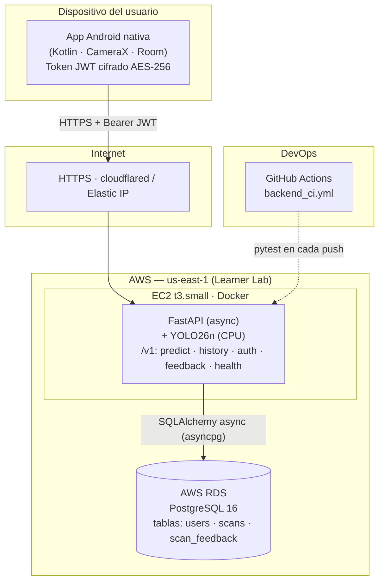

# Arquitectura de Despliegue, Ambientes y Backup (AWS) — MaduraApp

> **Documento autoritativo de infraestructura (EP3).** Reemplaza la descripción basada en Render/Supabase de la Evaluación 2: la arquitectura **evolucionó a AWS**. Cubre el modelo de despliegue, la configuración de servidores (Dockerfile + variables de entorno) y los procedimientos de respaldo, en línea con la Parte 2 del formato institucional.

---

## 1. Evolución de la arquitectura (honesto)

| Etapa | Backend | Base de datos | Exposición |
|-------|---------|---------------|------------|
| **EP2** (demo en clase) | Hosteado desde el **PC del estudiante** (escritorio), de forma remota | SQLite local | Túnel a internet |
| **EP3** (actual) | **AWS EC2 `t3.small`** con Docker | **AWS RDS PostgreSQL** (prod) · SQLite (dev/test) | HTTPS (cloudflared) / Elastic IP |

La app es **config-driven**: la base de datos se selecciona por la variable `DB_URL`, por lo que el salto SQLite → PostgreSQL es un cambio de configuración, no de código.

---

## 2. Vista de despliegue (diagrama actualizado)



**Flujo principal:** la app envía la imagen + JWT por HTTPS → FastAPI valida el token, ejecuta la inferencia YOLO26n en CPU, persiste el escaneo en RDS y devuelve el diagnóstico. El token se guarda cifrado (AES-256) en el dispositivo.

---

## 3. Configuración de servidores (paridad Dev/Prod)

Para garantizar paridad de ambientes, el contenedor Docker es **idéntico** en desarrollo y producción; solo cambian las variables de entorno.

### 3.1 Receta del servidor — Dockerfile

```dockerfile
FROM python:3.12-slim
WORKDIR /app
RUN apt-get update && apt-get install -y libgl1 libglib2.0-0 && rm -rf /var/lib/apt/lists/*
COPY requirements.txt .
RUN pip install --no-cache-dir -r requirements.txt
COPY . .
EXPOSE 8000
CMD ["uvicorn", "app.main:app", "--host", "0.0.0.0", "--port", "8000"]
```

### 3.2 Variables de entorno

**`.env.prod` (producción — AWS EC2 + RDS):**
```ini
ENVIRONMENT=production
JWT_SECRET_KEY=<secreto fuerte, generado con secrets.token_urlsafe(48)>
JWT_EXPIRE_DAYS=30
DB_URL=postgresql+asyncpg://<user>:<pass>@<rds-endpoint>.rds.amazonaws.com:5432/maduraapp
CORS_ORIGINS=https://maduraapp.cl
CONFIDENCE_THRESHOLD=0.55
```

**`.env.test` / dev (local):**
```ini
ENVIRONMENT=development
JWT_SECRET_KEY=dev_secret
DB_URL=sqlite+aiosqlite:///./maduraapp_dev.db
CORS_ORIGINS=*
```

> Los secretos **nunca** se versionan; el repositorio solo incluye `.env.example`. En producción la app **rechaza arrancar** con el secreto por defecto (validación en `core/config.py`).

### 3.3 Levantamiento en EC2

```bash
sudo docker build -t maduraapp-backend .
sudo docker run -d --name maduraapp --restart unless-stopped \
  -p 8000:8000 --env-file .env.prod maduraapp-backend
sudo docker exec maduraapp alembic upgrade head   # crea tablas en RDS
curl http://localhost:8000/v1/health
```

---

## 4. Procedimiento de copia de seguridad y restauración (RDS PostgreSQL)

Con la base de datos en **RDS PostgreSQL**, los respaldos usan las herramientas nativas de Postgres (re-validando el procedimiento del formato institucional).

**Paso 1 — Respaldo desde producción:**
```bash
pg_dump -h <rds-endpoint>.rds.amazonaws.com -U <user> -d maduraapp \
        -F c -b -v -f /backups/maduraapp_prod.backup
```

**Paso 2 — Preparar ambiente de pruebas (staging):**
```bash
psql -h <staging-endpoint> -U <user> -d maduraapp_test \
     -c "DROP SCHEMA public CASCADE; CREATE SCHEMA public;"
```

**Paso 3 — Restauración en staging:**
```bash
pg_restore -h <staging-endpoint> -U <user> -d maduraapp_test -v /backups/maduraapp_prod.backup
```

> **Respaldos gestionados:** AWS RDS realiza **snapshots automáticos diarios** y permite *point-in-time recovery*, por lo que el respaldo manual anterior complementa (no reemplaza) la protección que ofrece el servicio gestionado.

---

## 5. Consistencia arquitectónica (diagramas ↔ Docker ↔ pruebas)

| Elemento del diagrama | Configuración real | Evidencia de pruebas |
|-----------------------|--------------------|----------------------|
| Backend FastAPI en EC2/Docker | `Dockerfile` + `docker run` (§3) | 38 tests pytest |
| Base de datos PostgreSQL | `DB_URL=postgresql+asyncpg://…` | pytest sobre SQLite in-memory (paridad de esquema vía SQLAlchemy/Alembic) |
| Autenticación JWT | `core/security.py` | CP-01..03, CP-16..18 |
| Inferencia YOLO26n | `yolo_wrapper.py` + modelo 5,2 MB | 21 tests de estado de madurez |
| CI | `.github/workflows/backend_ci.yml` | suite en cada push |

La lógica de los componentes del diagrama es **coherente** con los archivos de configuración (Docker, `.env`) y con la evidencia de pruebas ejecutable en el repositorio.
